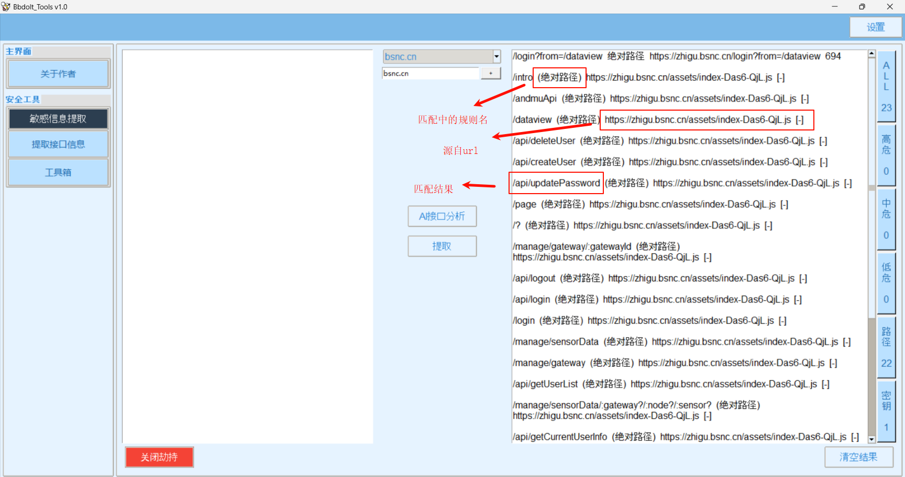
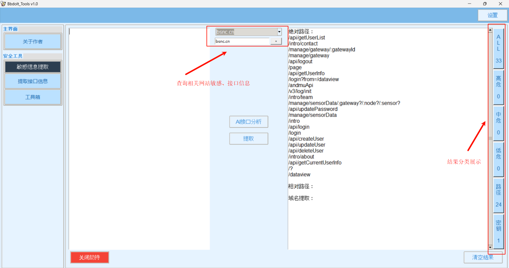
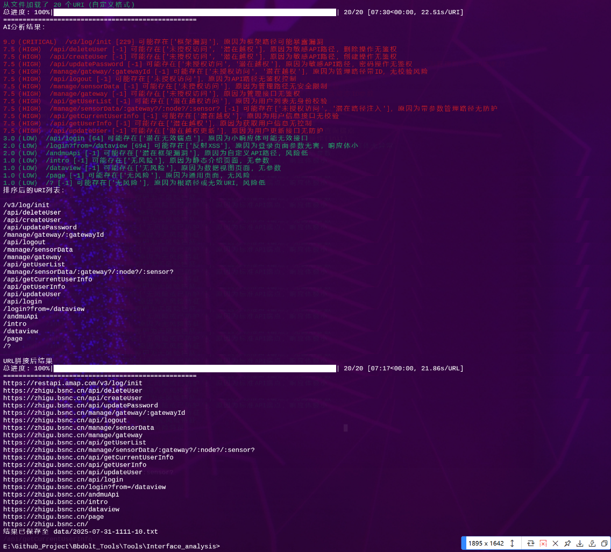
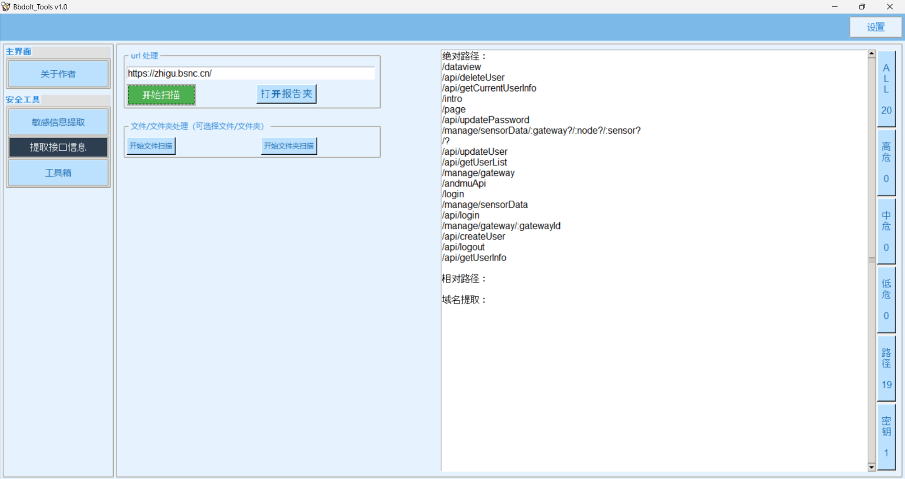
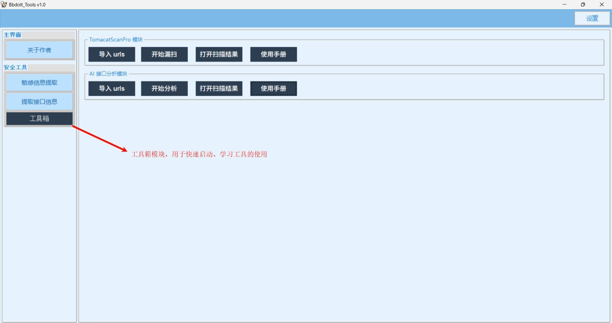

# Bbdolt_Tools


Bbdolt_Tools 是一个基于 Python 开发的安全工具集合，提供了一系列实用的安全测试和分析功能。该工具采用模块化设计，具有友好的图形界面，支持主题切换，易于扩展。

## 功能特点

- 📝 敏感信息提取
  - 支持主动、被动模式（配合 yakit）收集
  - 支持自定义多种正则匹配规则（匹配敏感信息泄露、接口路径获取）
  - 支持ai分析获取的接口路径信息、自动拼接url
  - 结果分类展示，支持根据自定义域名过滤结果

  
- 🔍 提取接口信息
  - 自动化获取一个网站js中的敏感信息以及接口信息，也支持从一个js文件或一个文件夹下的所有js文件进行提取
  - 结果分类展示

- 🧰 工具箱
  - 支持自定义工具、能快速打开常用自定义工具
  - 目前工具
    - TomcatScanPro 模块（扫描 Tomcat 部分漏洞以及弱口令）
    - AI 接口分析模块（输入uri列表自动分析，给出ai分析结果）

- 🎨 主题切换
  - 默认主题
  - 粉色主题
  - 浅蓝主题
  - 浅色主题

## 安装说明

### 环境要求

- Python 3.x
- Windows/Linux/MacOS

### 安装步骤

1. 配置环境
```bash
git clone https://github.com/Bbdolt/Bbdolt_Tools.git
cd Bbdolt_Tools
pip install -r requirements.txt
```
2. 配置 config.json
```
（1）配置路径（其他可以默认）
  - packerfuzzer
  - python
  - TomcatScanPro

（2）其他参数解释
  - theme    # 主题颜色（进入程序后配置）
  - http_port    # 被动模式监听端口
  - notepad    # 文本文件打开方式
  - deep_scan_packerfuzzer    # 影响`提取接口信息`模块，选择 packerfuzzer 扫描参数
  - ai_analysis_next    # 输出接口分析后，要不要根据当前已存在url将uri自动拼接为url
```
3. 配置 Tools/Interface_analysis/ai_config.json
```
- API_TOKEN: 使用硅基流动的API_TOKEN
- MODEL_NAME: 使用模型推荐 Qwen/Qwen2.5-Coder-32B-Instruct（收费推荐）、deepseek-ai/DeepSeek-V3（收费推荐）、Qwen/Qwen2.5-Coder-7B-Instruct（免费默认）
- deepseek-ai/DeepSeek-V3（效果好） > Qwen/Qwen2.5-Coder-32B-Instruct（性价比） > deepseek-ai/DeepSeek-R1（收费高，速度慢） > deepseek-ai/DeepSeek-R1-0528-Qwen3-8B（免费速度慢） > Qwen/Qwen2.5-Coder-7B-Instruct
```

4. 启动程序
```
python main.py

直接运行可执行程序
```

## 使用说明

### 敏感信息提取
0. 配置 yakit 插件，将流量镜像一份到 9015 端口的 http 服务（使用镜像的方式不会影响正常抓包速度）
  - 80591b41-2c88-4890-a90d-02396e8fa014 通过uuid导入
  - 通过 敏感信息提取器_Bbdolt.zip 导入
1. 启动程序后，默认显示敏感信息提取模块
2. 可以通过以下两种方式进行信息提取：
   - 直接在输入框中粘贴文本进行提取
   - 点击"开始劫持"按钮，进行HTTP请求拦截（配合yakit插件）
3. 提取结果会按照危险等级分类显示，可在 matches.py 文件中自定
4. 通过设置`过滤域名`可以指定输出结果来自那个域名下
5. 可以点击`AI接口分析`分析接口
6. 敏感信息提取-整体部分

7. 敏感信息提取-接口部分

8. AI接口分析结果（uri 风险分析结果、uri 风险排序、uri 完整路径拼接猜测）


### 提取接口信息
1. 输入网址，会利用 packerfuzzer 这款工具（https://github.com/rtcatc/Packer-Fuzzer?tab=readme-ov-file）
   进行分析爬取 js 文件，最后对 js 文件经过正则匹配获取敏感信息、接口路径
2. 输入的也可以是一个 js 文件或一个存放 js 文件的文件夹
3. 提取接口信息-主动 模块


### 工具箱
1. TomcatScanPro（https://github.com/lizhianyuguangming/TomcatScanPro）
2. AI接口分析模块，导入 urls 会打开一个 txt 文件，只需将 uri 一行一行写入即可自动分析
3. 工具箱模块 展示


### 主题切换
1. 点击右上角的"设置"按钮
2. 在设置页面选择喜欢的主题
3. 主题会立即生效并自动保存

## 开发指南

### 目录结构

```
Bbdolt_Tools/
├── main.py              # 主程序入口
├── config.json          # 配置文件
├── LICENSE              # 开源许可证
├── README.md            # 项目说明文档
├── README.html          # HTML版说明文档
├── requirements.txt     # Python依赖项列表
├── regex_rules.py       # 正则匹配规则配置
├── ico/                 # 图标资源
│   ├── icon.ico
│   ├── icon32.png
│   └── icon32_32x32.ico
├── docs/                # 文档目录
│   └── development.md   # 开发文档
├── history/             # 历史记录目录
├── js_test/             # JS测试目录
│   └── 1.js             # 测试用JS文件
├── modules/             # 功能模块目录
│   ├── about.py         # 关于信息模块
│   ├── find_path.py     # 路径查找模块
│   ├── matches.py       # 敏感信息提取模块
│   ├── quick_start.py   # 快速开始模块
│   └── template.py      # 模板模块
├── Tools/               # 工具箱目录
│   ├── 403Bypass/       # 403绕过工具
│   ├── Interface_analysis/  # 接口分析工具
│   ├── TomcatScanPro/   # Tomcat扫描器
│   ├── Venom-JWT/       # JWT漏洞检测
│   └── webpackscan/     # Webpack分析工具
└── __pycache__/         # Python缓存目录
```

### 模块开发

Bbdolt_Tools 采用模块化设计，允许开发者轻松添加新功能。每个模块需要满足以下基本要求：

1. 继承 `ttk.Frame` 类
2. 实现标准初始化接口
3. 提供模块创建函数

#### 添加新模块的步骤

1. 在 `modules` 目录下创建新的 Python 文件，例如 `your_module.py`
2. 按照上述结构实现您的模块类和创建函数
3. 在 `main.py` 中注册您的模块：

```python
# 导入您的模块创建函数
from modules.your_module import create_module_frame as create_your_module

# 在模块列表中注册
self.module_creators = {
    # 现有模块
    "敏感信息提取": create_matches_frame,
    # 您的新模块
    "您的模块名称": create_your_module,
    # ... 其他模块
}
```

#### 资源管理

模块应当使用主程序提供的资源管理机制注册和清理资源：

```python
# 注册资源
self.main_app.register_resource("resource_id", self.cleanup_function)

# 取消注册
self.main_app.unregister_resource("resource_id")
```

#### 主题支持

模块应实现主题支持，以便与整个应用程序的外观保持一致：

```python
def apply_theme(self, theme_name):
    """应用指定的主题样式"""
    # 根据主题名称应用相应样式
    # ...
```

详细的开发文档请参考 [开发文档](docs/development.md)。

## 配置文件

配置文件 `config.json` 用于存储应用程序设置：

```json
{
    "theme": "默认",
    "other_settings": {}
}
```

## 常见问题

**Q: 如何添加新的匹配规则？**

A: 在 `matches.py` 的 `rules` 列表中添加新的规则字典，包含 `Rule`（正则表达式）和 `VerboseName`（规则名称）。

**Q: 如何修改默认端口？**

A: 在 `config.json` 中修改 `http_port` 的端口值（默认为9015）。

**Q: 如何添加新的工具模块？**

A: 按照 [开发文档](docs/development.md) 中的说明创建新模块，实现必要的接口，并在 `main.py` 中注册。